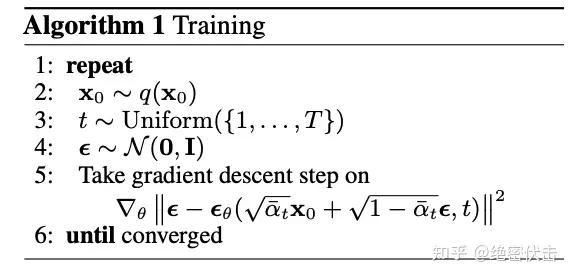
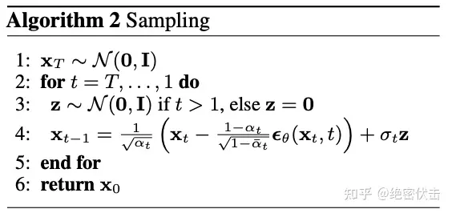

# Diffusion_from_scratch

## Introduction
Welcome to the **Diffusion_from_scratch** repository! This project is a reproduction of the Stable Diffusion DDPM model based on the MNIST handwritten digit dataset. It can take input guiding digits and generate images corresponding to those digits.

## preliminary
- **diffusion forward process**

- **diffusion sampling process**

## Contributing

Contributions are highly appreciated! If you have improvements, bug fixes, or new models to add, please fork the repository and submit a pull request. For major changes, please open an issue first to discuss what you would like to change.

1. Fork the Project
2. Create your Feature Branch (`git checkout -b feature/YourFeature`)
3. Commit your Changes (`git commit -m 'Add some YourFeature'`)
4. Push to the Branch (`git push origin feature/YourFeature`)
5. Open a Pull Request

## License

Distributed under the MIT License. See `LICENSE` for more information.

## Acknowledgements

- [PyTorch](https://pytorch.org/) - The deep learning framework used in this repository.
- [Pytorch-diffusion](https://github.com/owenliang/pytorch-diffusion) - 基于mnist手写数字数据集的stable diffusion模型复现

