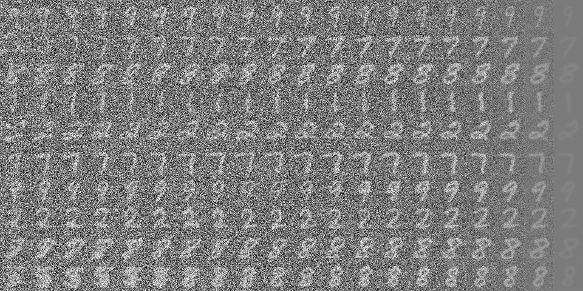
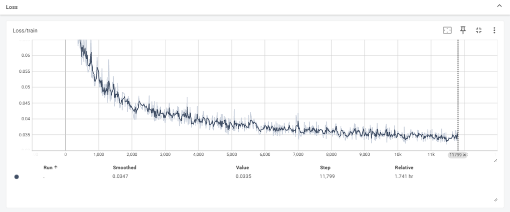

# Diffusion_from_scratch

## Introduction

从0到1手写基于mnist手写数字数据集的diffusion模型复现

## Preliminary
- **扩散模型的前向传播过程**

- **扩散模型的采样过程**

## Result

- **采样图片**

- **loss**

## TODO

引入cross-attention来将cls-embedding放入unet中, 来实现可控图像生成, 即stable diffusion

## Acknowledgements

- [Pytorch-diffusion](https://github.com/owenliang/pytorch-diffusion)
- [Stable Diffusion 原理介绍与源码分析](https://blog.csdn.net/Eric_1993/article/details/129600524?spm=1001.2014.3001.5501)
- [扩散模型(Diffusion Model)详解：直观理解、数学原理、PyTorch 实现](https://zhouyifan.net/2023/07/07/20230330-diffusion-model/)

