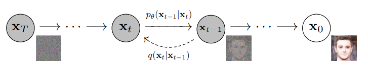
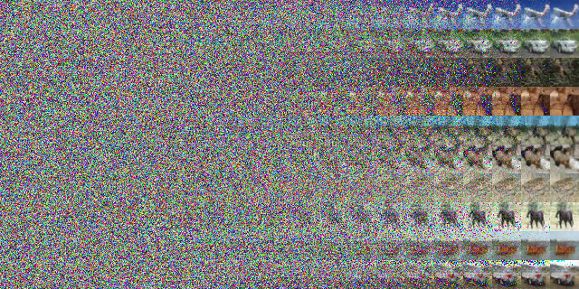

# Diffusion Models from Scratch

A PyTorch implementation of diffusion models built from scratch, featuring:

## Key Features:

### 🎯 From-Scratch Implementation
- Clean, modular codebase

### 🚀 Sampling Methods
- DDPM (Denoising Diffusion Probabilistic Models)
- DDIM (Denoising Diffusion Implicit Models)
- *(More to come...)*

### 🧠 Network Architectures
- UNet
- DiT (Diffusion Transformer) 
- UViT (U-Vision Transformer)

### 📊 Datasets Support
- MNIST
- CIFAR-10
- *(More to come...)*

## Preliminary
- **diffusion process**

## Result

- **result on mnist dataset**

- **result on cifar-10 dataset**

- **loss**

## TODO List

- [x] Introduce cross_attention to fuse image information and classification information
- [x] Implement inference code
- [x] Experiment with different model architectures, e.g., Unet, DiT, UViT, etc.
- [ ] Experiment with different noise schedulers, e.g., DDPM, DDIM, DPM-Solver, etc.
- [ ] Add evaluation metrics such as FID and CLIP score
- [ ] Experiment with different datasets, e.g., MNIST, CIFAR-10, text2image datasets, etc.
- [ ] Experiment with different training methods, e.g., LoRA, etc.

## Acknowledgements

- [Pytorch-diffusion](https://github.com/owenliang/pytorch-diffusion)
- [Diffusion Transformer](https://arxiv.org/abs/2212.09748)
- [A ViT Backbone for Diffusion Models](https://arxiv.org/abs/2209.12152)
- [Tutorial on Diffusion Models for Imaging and Vision](https://arxiv.org/abs/2403.18103)
- [Probabilistic Diffusion Model概率扩散模型理论与完整PyTorch代码详细解读](https://www.bilibili.com/video/BV1b541197HX/?spm_id_from=333.1387.0.0&vd_source=634f9cd56b5b0cf10f6976238630bd8d)
- [Stable Diffusion 原理介绍与源码分析](https://blog.csdn.net/Eric_1993/article/details/129600524?spm=1001.2014.3001.5501)
- [扩散模型(Diffusion Model)详解：直观理解、数学原理、PyTorch 实现](https://zhouyifan.net/2023/07/07/20230330-diffusion-model/)
