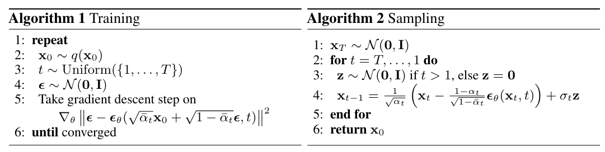
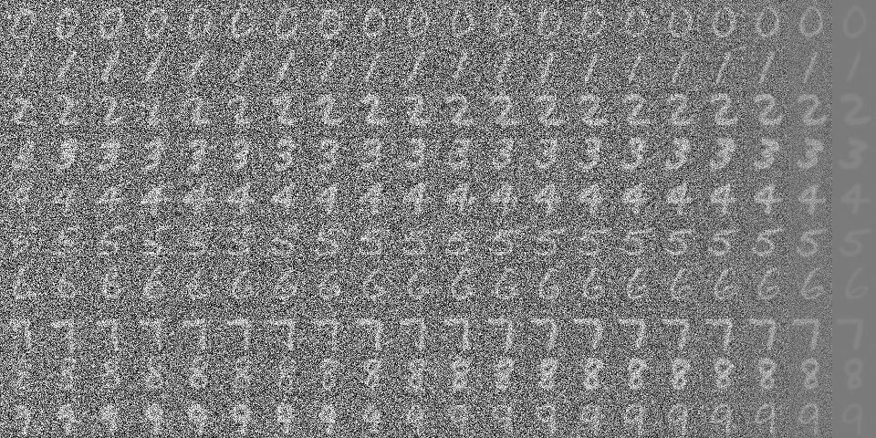
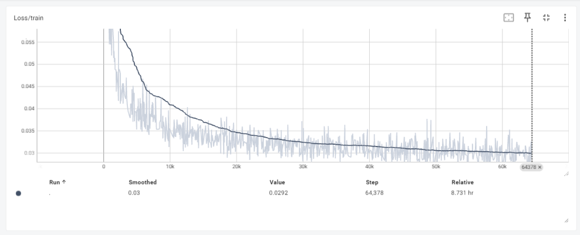

# Diffusion_from_scratch

## Introduction

从0到1手写基于mnist手写数字数据集的stable diffusion模型复现

## Preliminary
- **DDPM forward and denosing process**

## Result

- **采样图片**

- **loss**

## TODO List

- [x] Introduce cross_attention to fuse image information and classification information
- [x] Implement inference code
- [ ] Experiment with different model architectures, e.g., DiT, UViT, etc.
- [ ] Experiment with different noise schedulers, e.g., DDIM, DPM-Solver, etc.
- [ ] Add evaluation metrics such as FID and CLIP score
- [ ] Experiment with different datasets, e.g., text2image datasets, etc.
- [ ] Experiment with different training methods, e.g., LoRA, etc.

## Acknowledgements

- [Pytorch-diffusion](https://github.com/owenliang/pytorch-diffusion)
- [Stable Diffusion 原理介绍与源码分析](https://blog.csdn.net/Eric_1993/article/details/129600524?spm=1001.2014.3001.5501)
- [扩散模型(Diffusion Model)详解：直观理解、数学原理、PyTorch 实现](https://zhouyifan.net/2023/07/07/20230330-diffusion-model/)
